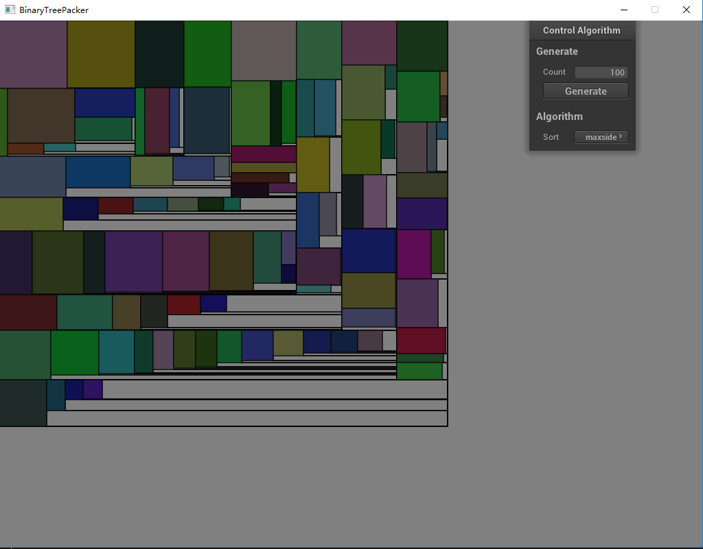

# BinaryTreePacker
This is a binary tree packer algorithm in C++ and add a simple gui with **nanogui** library.
> The source is here. [Binary Tree Bin Packing Algorithm](https://codeincomplete.com/posts/bin-packing/)

# Project Structure

# How to run the project
```bash
# clone the project to you workspace
git clone https://github.com/superman-t/BinaryTreePacker.git  

# because use the **nanogui** as a submodule, so you need init and update submodule  
git submodule init  
git submodule update --recursive  

# just distinct the project and build, in the project folder make a build folder
mkdir build  
cd build  

# use cmake generate project and build, can't run release because the nanogui crash with Release
cmake ..  
cmake --build . --config Debug
```
# Steps of algorithm

# Result of algorithm 
Random generate 100 rectangle, and sort by maxside way.
